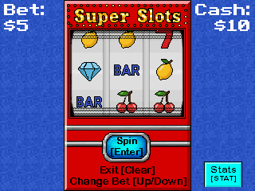

# Slot Machine for TI-84 Plus CE

A graphical slot machine game for the TI-84 Plus CE calculator, featuring smooth animations, a betting system, and persistent save data.

## Screenshot


## Features

- **Graphical Interface**: Custom 32x32 pixel art symbols and a vibrant background.
- **Smooth Animations**: Realistic reel spinning with acceleration and deceleration.
- **Betting System**: dynamic betting with a $100 starting balance.
- **Save Data**: Your money is saved automatically between sessions (APPVAR: `SLOTSDAT`).
- **Pity System**: Go bankrupt? The house gives you a $10 pity grant to keep playing.
- **Win logic**: 
  - 3 of a kind wins big!
  - 2 of a kind returns your bet (or a small profit).

## Controls

| Key | Action |
| --- | --- |
| **[UP]** | Increase Bet (+$5) |
| **[DOWN]** | Decrease Bet (-$5) |
| **[ENTER]** | Spin |
| **[CLEAR]** | Exit Game |

## Build Instructions

To build this project, you need the [CE C/C++ Toolchain](https://github.com/CE-Programming/toolchain).

1. Clone the repository.
2. Open a terminal in the project directory.
3. Run `make`.

```bash
make
```

## Installation

1. Send the `bin/SLOTS.8xp` file to your calculator using TI-Connect CE or TiLP.
2. Run the program from the `[prgm]` menu (via a launcher shell like Cesium or directly if using the C libraries loader).
